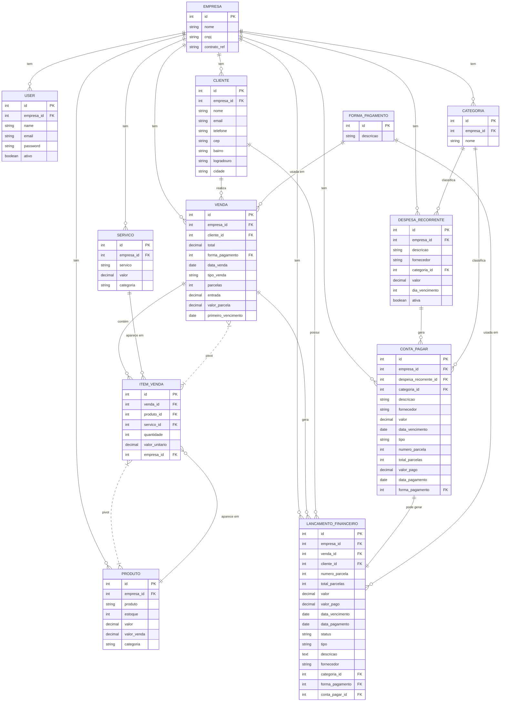

## Diagrama MER (Mermaid)

Observações:
- Entidades e campos baseados em `app/Models/*` (`$fillable`).
- Campos FK inferidos a partir de relações `belongsTo` e nomes de campos (ex.: `cliente_id`, `empresa_id`).
- Se quiser, gero uma imagem PNG (PlantUML ou Mermaid) e salvo em `resources/erd/`.
